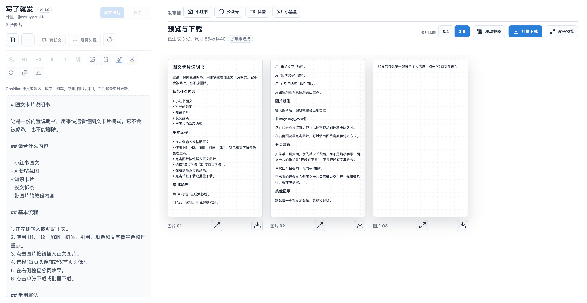
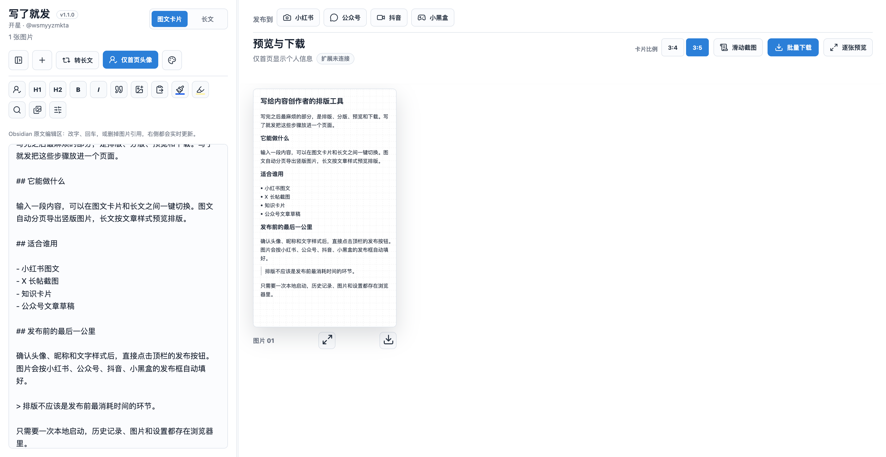
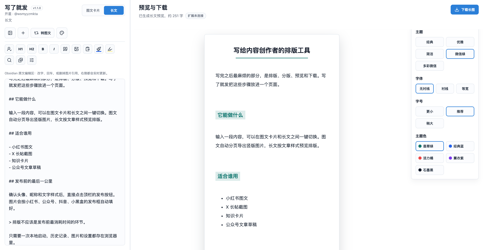

# 开星｜文象（Write Then Publish）

面向内容创作者的本地排版编辑器，由 开星二次定制。

二次定制：开星（@wsmyyzmkta）
输入一段内容后，可以在「图文卡片」和「长文」之间一键切换：图文自动分页导出图片，长文按文章样式预览排版。

它解决的不是“写作”本身，而是写完之后最麻烦的部分：排版、分版、预览、下载、历史保存和多格式复用。

## 原始出处与致谢

本项目基于 [捏捏番茄的 write-then-publish](https://github.com/fxyadela/write-then-publish) 二次定制与扩展。

原作者：捏捏番茄。此版本新增了个人品牌定制、Obsidian 图文导入、Markdown 实时预览、图片本地媒体库和离线导出等能力。

## License

本项目基于 MIT License 开源，版权归原作者与维护者共同持有。详细条款见 [LICENSE](LICENSE)。

## 预览

### 图文卡片：每页显示头像



### 图文卡片：仅首页显示头像



### 长文



## 核心功能

- `图文卡片模式`：长文本自动分页，生成适合小红书 / X 风格发布的竖版图片。
- `长文模式`：支持 Markdown 长文预览，提供主题、字体、字号和主题色设置。
- `一键互转`：图文可以转长文，长文也可以自动分页转成图文卡片；内容没写完也能转换。
- `滑动截图模式`：在单张长卡片内滚动查看内容，适合手动截图。
- `历史记录`：自动保存草稿，支持新建、恢复、删除。
- `历史分类筛选`：历史记录自动标记为「图文」或「长文」，可按类型筛选。
- `个人信息定制`：支持修改头像、名称、昵称，并可选择每页显示头像或仅首页显示。
- `Obsidian 图文导入`：粘贴 Obsidian Markdown，拖入图片附件后自动识别 `![[图片.png]]` 与 `` 并保留图片位置。
- `Obsidian 仓库连接`：首次选择一次 Obsidian 仓库根目录，之后直接粘贴 Markdown 即可按图片路径自动读取本机附件。
- `快捷放图`：可在正文编辑框直接粘贴截图、复制的图片或拖入图片文件。
- `图片处理`：支持正文插图、多图上传、头像裁剪、图片位置/大小调整和批量宽度设置。
- `文字样式`：支持大标题、小标题、加粗、斜体、引用、字体颜色、文字背景色。
- `样式互通`：图文卡片和长文共用字体颜色、文字背景色等行内样式语法。
- `手动留白`：图文卡片会保留编辑框中的回车空行，方便手动控制节奏。
- `行距控制`：图文卡片行距最低可调到 `1.0`，用于更紧凑的文字排版。
- `段间距控制`：正文段落不会额外叠加过大的段前段后空隙，手动空行按接近小红书图文的段落间隔显示。
- `字体设置`：支持中文字体和英文字体分别选择。
- `查找替换`：支持查找、替换当前、全文替换。
- `导出下载`：支持单张下载和批量打包下载。
- `长文下载`：长文模式支持导出为 PNG 长图，保留当前排版样式。
- `Chrome 自动发布`：图文卡片可直接填入小红书、微信公众号、抖音、小黑盒发布页。
- `编辑撤销`：支持 `Command + Z` 撤销和 `Command + Shift + Z` 重做。
- `黑白主题`：界面按钮、卡片背景和字体颜色会随主题自适应。

## 两种工作区

### 图文卡片

适合把长文拆成多张图片发布。系统会根据页面容量自动切割内容，并尽量保留标题、引用、加粗、颜色、图片等样式。

适用场景：

- 小红书图文
- X 长帖截图
- 知识卡片
- 长文拆条
- 图文教程

### 长文

适合先把内容整理成文章样式。支持 Markdown 标题、引用、代码块、图片和基础行文结构，并提供独立的长文样式设置。

适用场景：

- 公众号文章草稿
- 长文预览
- Markdown 排版
- 图文内容转长文沉淀

## 一键互转

顶部的转换按钮会根据当前模式自动变化：

- 在图文模式下：显示 `转长文`
- 在长文模式下：显示 `转图文`

转换不会重写内容，只会切换排版输出方式：

- 图文转长文：当前编辑内容会进入长文预览。
- 长文转图文：当前编辑内容会自动分页生成图文卡片。

这意味着你可以先随便写，不必一开始就决定最终发布格式。

## 历史记录

左侧历史栏会自动保存当前草稿，并支持：

- 点击恢复历史内容
- 删除不需要的记录
- 按 `全部 / 图文 / 长文` 筛选
- 自动显示每条记录的类型标签

历史记录保存在浏览器本地存储中，不依赖后端服务。

## 安装与运行

### 网页版

需要 Chrome/Edge 和 Python 3（或 Node 环境）：

```bash
git clone https://github.com/GeKaixing/write-then-publish.git
cd write-then-publish
npm start
```

然后访问：

```text
http://127.0.0.1:5173/
```

项目是纯前端静态页面，不需要安装依赖。不要直接双击打开 `index.html`：`file://` 协议下 Canvas 的 `toBlob()` 会因浏览器安全策略抛出 `SecurityError`，导致导出下载失败，请始终通过本地服务访问。

### Chrome 自动发布扩展

1. 启动网页版并保持页面打开。
2. 在 Chrome 打开 `chrome://extensions/`。
3. 打开右上角「开发者模式」。
4. 点击「加载已解压的扩展程序」，选择仓库里的 `extension/` 目录。
5. 回到「文象」页面，执行 `Command + Shift + R` 强刷一次，直到顶部显示「扩展已连接」。

安装后，在图文卡片模式点击顶栏的「小红书 / 公众号 / 抖音 / 小黑盒」按钮，扩展会打开对应平台发布页并自动填入图片、标题和正文；确认平台已登录后，手动点击发布。

### Obsidian 插件

1. 把 `obsidian-plugin/` 整个目录复制到笔记仓库的 `.obsidian/plugins/write-then-publish/`。
2. 在 Obsidian 设置中启用社区插件，然后启用「文象」。
3. 使用命令面板执行「打开『文象』」。

插件与网页版功能一致，支持 `![[图片.png]]` 和 `` 导入；导出文件会写入当前活动笔记所在的仓库目录。

## 使用流程

### 快速开始

1. 在左侧编辑框输入或粘贴内容。
2. 选择 `图文卡片` 或 `长文` 工作区。
3. 用工具栏调整标题、加粗、斜体、引用、颜色、背景色和图片。
4. 修改头像、名称、昵称和头像显示方式。
5. 需要留白时，在编辑框里直接回车空行，右侧图文会保留这些空白行。
6. 在右侧预览区检查排版。
7. 需要复用时点击 `转长文` 或 `转图文`。
8. 图文模式下可单张下载或批量下载。

### 发布到平台

1. 切换到「图文卡片」模式并确认卡片预览正确。
2. 确认顶部状态显示「扩展已连接」。
3. 点击目标平台按钮（小红书 / 公众号 / 抖音 / 小黑盒）。
4. 扩展自动打开发布页并填入内容，登录状态下确认无误后手动发布。

发布只负责自动填入，不会代替你点击发布按钮。

## 文字上色

点击画笔按钮后：

1. 选择字体颜色。
2. 点击 `确定`。
3. 在编辑框中选中需要上色的文字。

工具会自动给选中文字添加颜色标记，并刷新右侧预览。文字背景色也是同样逻辑。

## 图片与头像

- 头像支持上传和裁剪。
- 正文图片支持插入、多图上传、裁剪、调整大小和对齐。
- 图片面板支持输入宽度百分比后批量应用，图片会按原比例等比缩放。
- 图片面板支持批量设置固定宽高；固定框会按原比例居中裁切，不会把图片拉变形。
- 图片默认尽量保留原比例，不主动压缩画质。
- 如果图片已经裁好，可以直接上传使用。

## 技术说明

- 纯前端实现，无需后端服务。
- 图文卡片使用 Canvas 渲染。
- 批量下载使用 JSZip 在浏览器内打包。
- 草稿和历史记录使用浏览器本地存储保存；图片使用 IndexedDB 本地媒体库保存，避免大图占满缓存。
- 部署可直接使用 Vercel 静态站点配置。

## 项目结构

```text
.
├── index.html
├── package.json            # 唯一版本源
├── scripts/sync-surfaces.mjs
├── extension/              # Chrome 扩展
├── obsidian-plugin/        # Obsidian 插件
├── src
│   ├── app.js
│   └── styles.css
├── vendor
│   ├── html2canvas.min.js
│   └── jszip.min.js
├── docs
│   └── screenshots
└── assets
```

## 版本管理

四端（网页 / Obsidian 插件 / Chrome 扩展 / Codex skill）共用同一个版本号，唯一来源是根目录 `package.json` 的 `version` 字段。

发版或改完共享资源后执行：

```bash
# 改版本号
npm version patch --no-git-tag-version   # 或 minor / major / 手动改 package.json

# 同步到各端
npm run sync
```

说明：

- `npm run sync`：写入网页端 `APP_VERSION`、Obsidian `manifest.json` / `versions.json`、扩展 `manifest.json` + `content.js`，并同步 skill 内置前端副本
- `npm run sync:plugin` / `sync:extension` / `sync:skill` / `version:sync`：只同步指定目标
- skill 默认目录：`~/.codex/skills/write-then-publish-render`，可用环境变量 `WTP_SKILL_DIR` 覆盖

## 感谢fxyadela开源
https://github.com/fxyadela/write-then-publish
